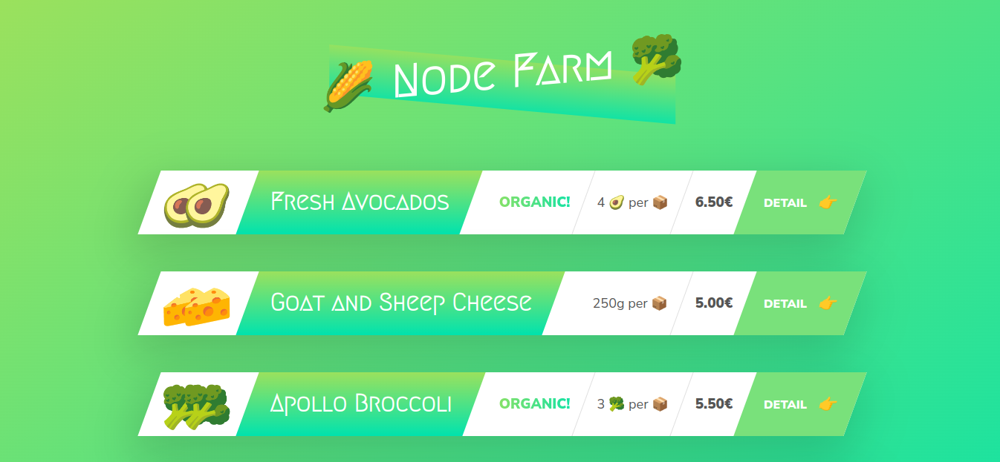
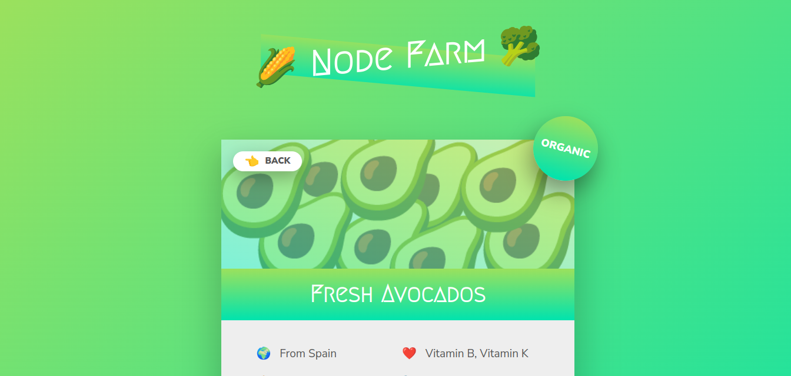

# Node Farm - A Node.js Project

## Overview

Node Farm is a small application developed as part of the Node.js, Express, MongoDB & More: The Complete Bootcamp 2024 course by Jonas Schmedtmann. This application provides information about various vegetables and vegetarian products.

## Main Page

The main page of Node Farm displays an overview of different vegetables and vegetarian products available. Users can browse through the list to learn more about each item.

### Vegetables

1. Baby Carrots
2. Avocado
3. Broccoli
4. Corn

# to install all dependencies for this application
    - npm install
    - nodemon index.js

## Demo Images

